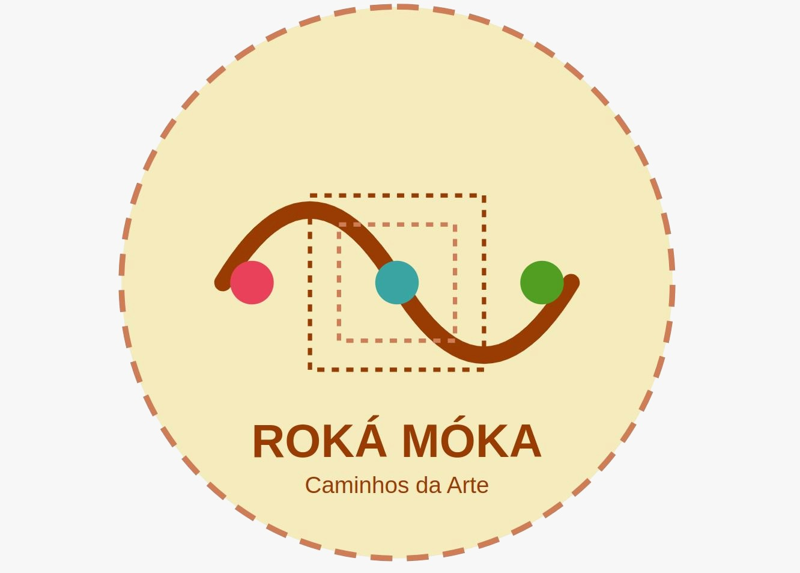

# Roká Moká

<p align="center">
  
</p>

O **Roká Moká** é um aplicativo móvel para mediação cultural digital gamificada, desenvolvido para apoiar visitas a exposições por meio da leitura de QR Codes, consulta a informações sobre obras e acompanhamento do progresso do visitante.

## Aplicativo Android

No momento, apenas a versão para **Android** está disponível.

O arquivo disponibilizado neste repositório é:

```text
roka_moka_prod_v5.apk
```

Para instalar o aplicativo, baixe o arquivo APK diretamente pelo celular Android e execute a instalação manualmente. Como o aplicativo ainda não está disponível em lojas oficiais, pode ser necessário autorizar, nas configurações do dispositivo, a instalação de aplicativos provenientes de fontes externas.

## Conta de demonstração

Use a seguinte conta para acessar o aplicativo:

```text
Usuário: sbie2026
Senha: Sbie!2026
```

## QR Codes de teste

Após instalar o aplicativo e acessar a conta de demonstração, utilize a funcionalidade de leitura de QR Codes para simular uma visita à exposição.

Os QR Codes abaixo permitem acessar informações sobre obras da exposição.

<p align="center">
  
  
</p>

<p align="center">
  
  
</p>


## Como testar

1. Baixe o arquivo `roka_moka_prod_v5.apk` em um celular Android.
2. Instale o aplicativo manualmente.
3. Autorize a instalação a partir de fontes externas, caso o Android solicite.
4. Acesse o aplicativo usando a conta de demonstração.
5. Use a leitura de QR Codes do aplicativo para escanear os quatro QR Codes disponíveis neste repositório.
6. Verifique o acesso às informações da exposição e o registro de progresso no aplicativo.

## Observação

Este repositório foi organizado para fins de avaliação do artefato de pesquisa. A versão disponibilizada permite reproduzir os cenários exploratórios descritos no artigo e verificar funcionalidades principais, como autenticação, leitura de QR Codes, consulta a obras e registro de progresso.
